# Employee Management System With Role Based Authorization

## Project Description

- Employee Management System with role based authentication Application allow only authorized person or which endpoint permit all

### Back-end:
- JAVA:- Java is a popular programming language, It is used for Mobile applications, Desktop applications, Web applications,Web servers and application servers,Games,Database connection etc.It is open-source and free, secure, fast and powerful.Java is an object oriented language which gives a clear structure to programs and allows code to be reused with lowering development costs.
- MySQL Database:- MySQL is a popular open-source database management system. used for storing and organizing data. It is known for its fast performance, reliability, and ease of use, based on the Structured Query Language (SQL).used to create and modify databases, tables, and other database objects.
- SpringSecurity-Spring Security is a framework that provides authentication, authorization, and protection against common attacks. With first class support for securing both imperative and reactive applications, it is the de-facto standard for securing Spring-based applications. 
- Spring Boot- Spring Boot is an open source Java-based framework used to create a micro-Service. It is developed by Pivotal Team and is used to build stand-alone and production ready spring applications.
- JPA:-JPA stands for Java Persistence API (Application Programming Interface).It is a Java specification that gives some functionality and standard to ORM tools. It is used to examine, control, and persist data between Java objects and relational databases.
- MAVEN:-Maven is a popular open-source build tool developed by the Apache Group to build, publish, and deploy several projects at once for better project management.

## Database:

- In this project whatever data is submited by user it get save in MYSQL Database. and user also retrive data from the database.
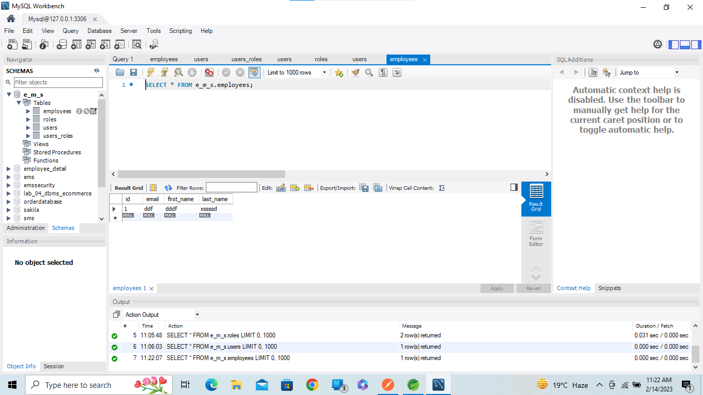
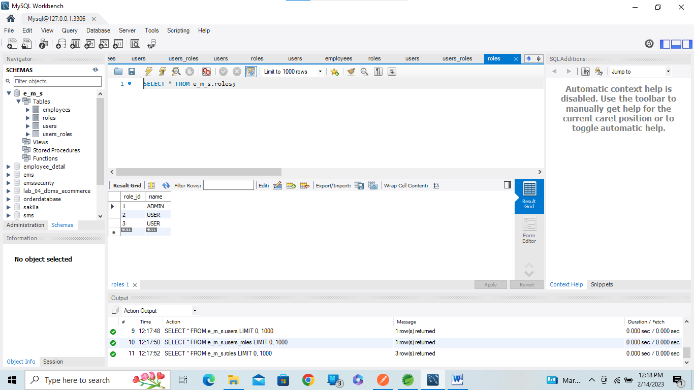

### CREATE-ROLE-1.Your application should be able to add roles in the database dynamically in the db.

#### CREATE ROLE

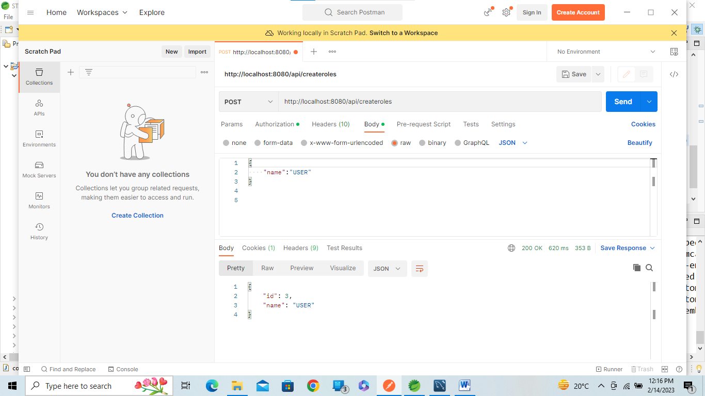

### 2. Your application should be able to add Users in the db which can be used for authentication purposes.

#### Add Users

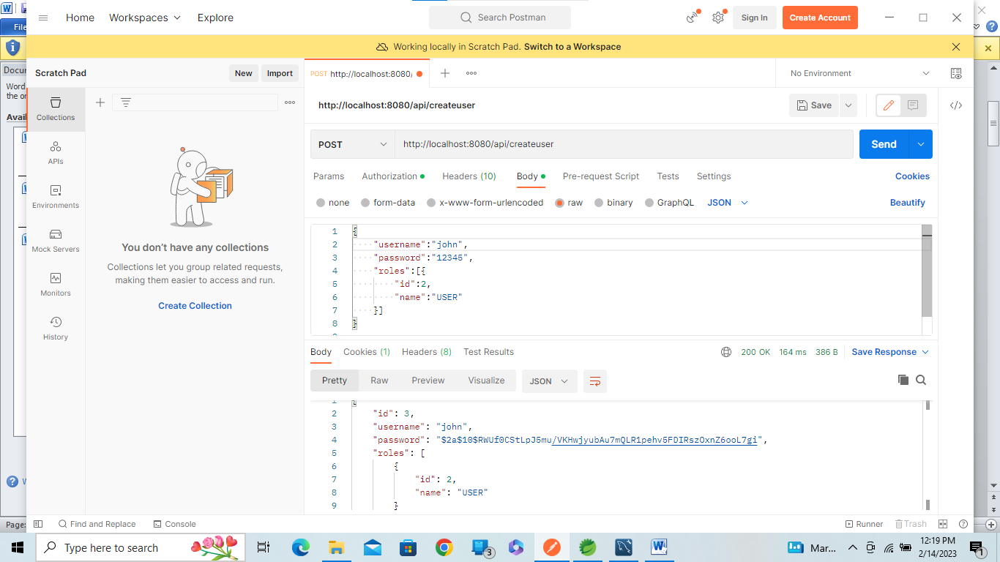

### 3. Now Your application should be able to add employees data in the db if and only if the authenticated user is ADMIN-

admin can add Employee
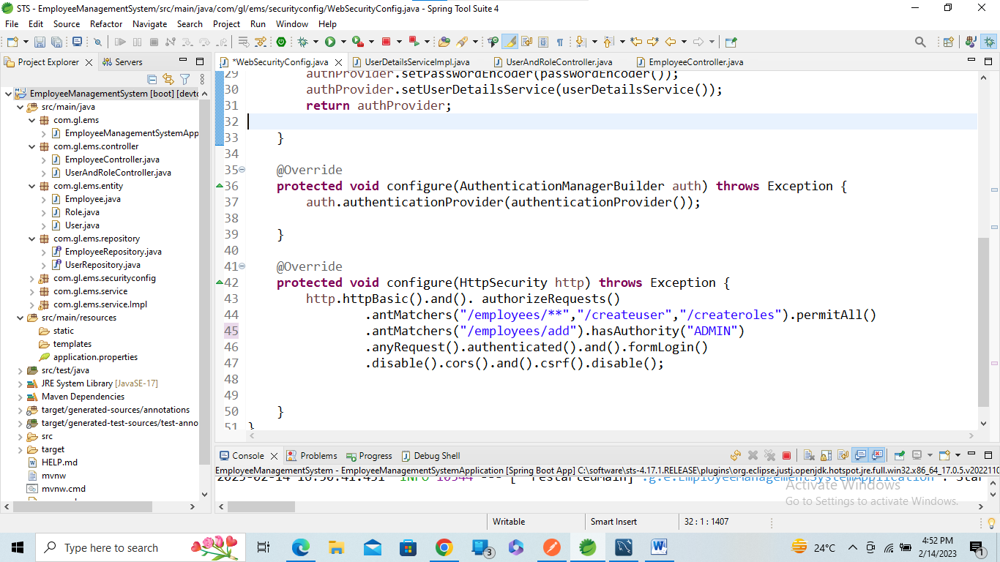
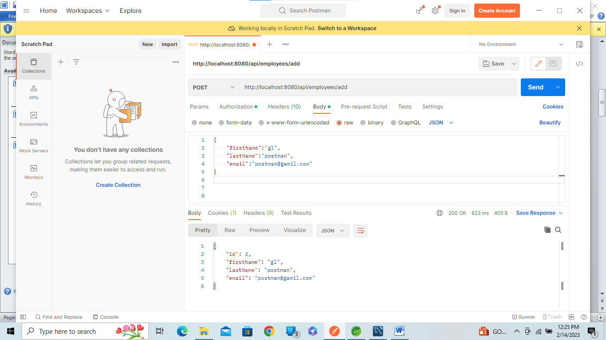
### 4. Your application should provide an endpoint to list all the employees stored in the database.
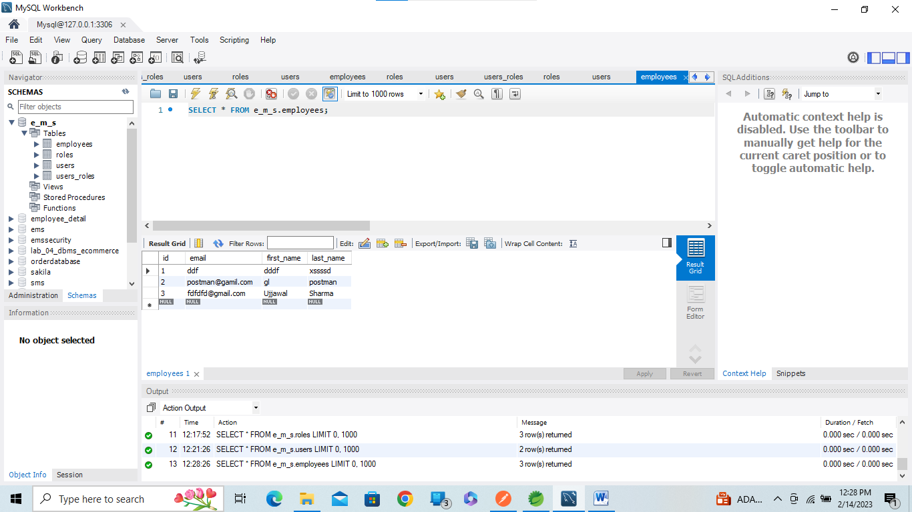
### 5. Your application should provide endpoint to fetch or get an employee record specifically based on the id of that employee-

http://localhost:8080/api/employees/2
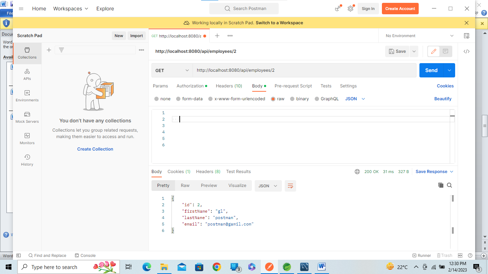

### 6. Your application should provide an endpoint to update an existing employee record with the given updated json object.

#### Before Updating

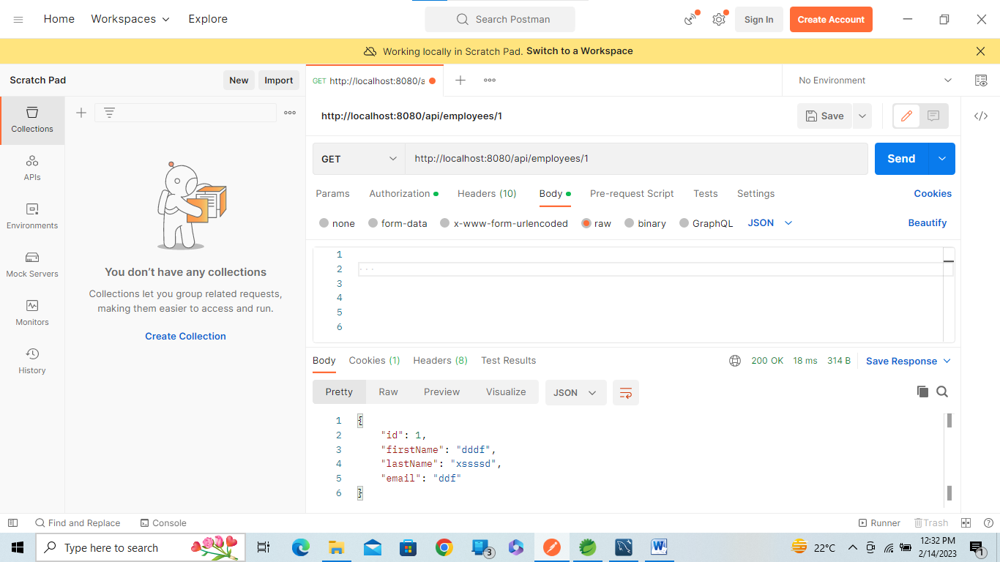

#### After Updating

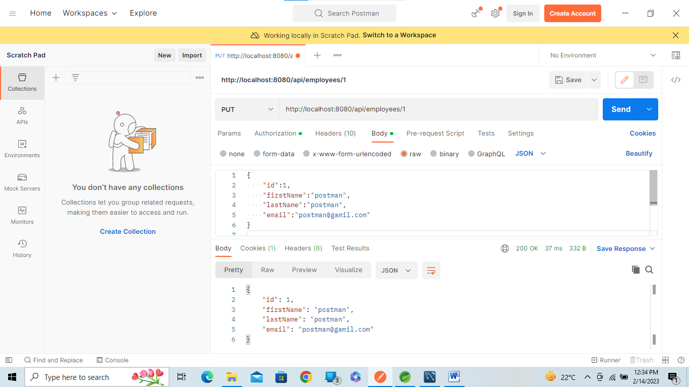

### 7. Your application should also provide an endpoint to delete an existing employee record based on the id of the employee-

#### Delete

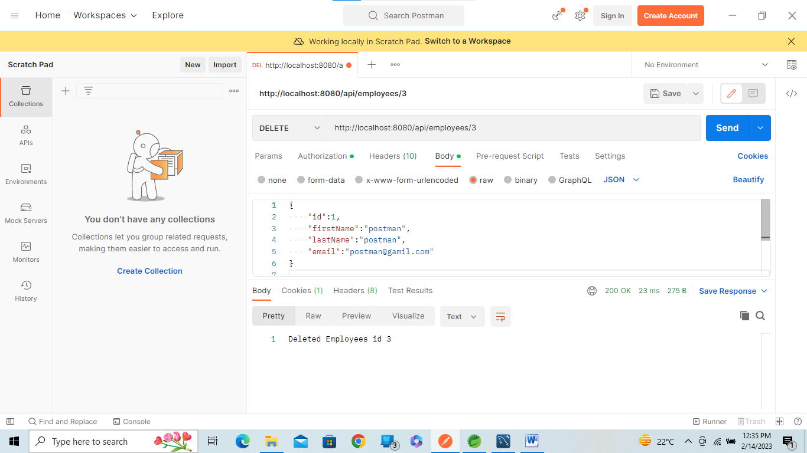

### 8.  Your application should provide an endpoint to fetch an employee by his/her first name and if found more than one record then list them all-

#### Search by FirstName
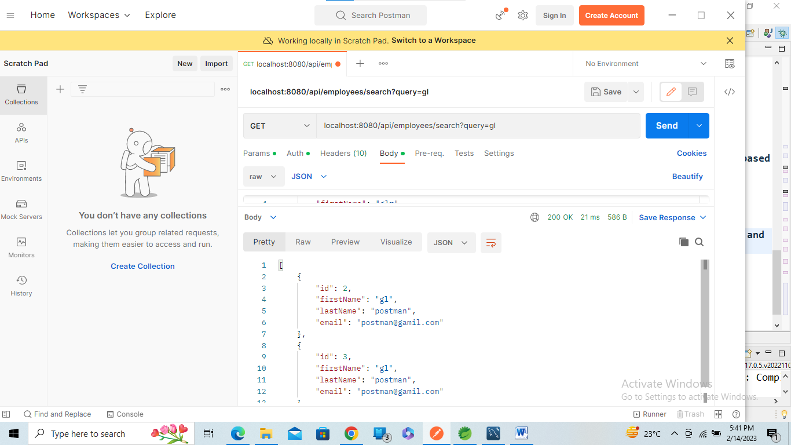

### 9. Your application should be able to list all employee records sorted on their first name in either ascending order or descending order .

#### ASC ORDER

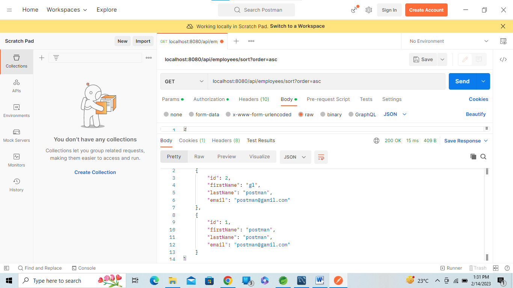
#### DESC ORDER

